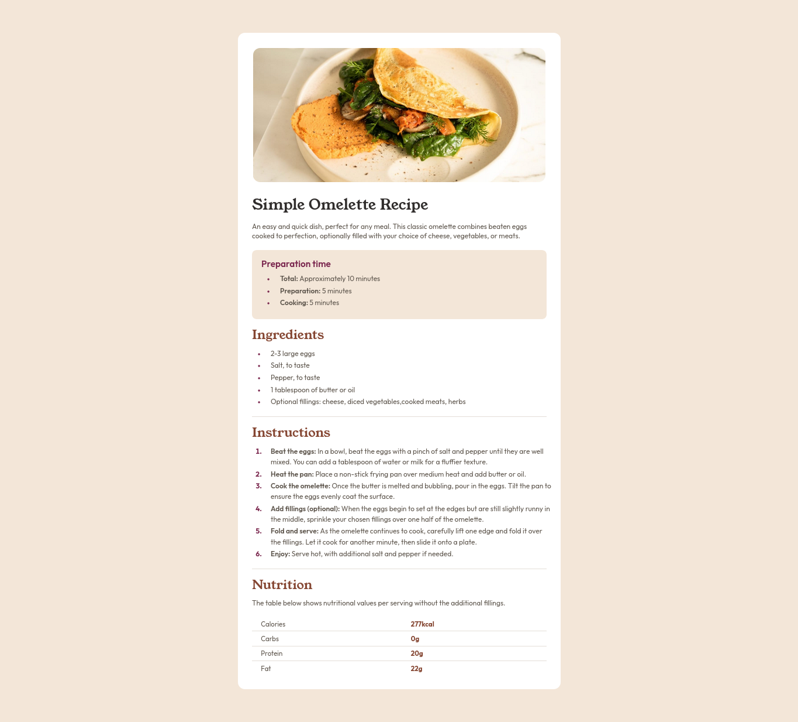

# Frontend Mentor - Recipe page solution

This is a solution to the [Recipe page challenge on Frontend Mentor](https://www.frontendmentor.io/challenges/recipe-page-KiTsR8QQKm). Frontend Mentor challenges help you improve your coding skills by building realistic projects.

## Table of contents

- [Overview](#overview)
  - [Screenshot](#screenshot)
  - [Links](#links)
- [My process](#my-process)
  - [Built with](#built-with)
  - [What I learned](#what-i-learned)
  - [Continued development](#continued-development)
  - [Useful resources](#useful-resources)

## Overview

### Screenshot



### Links

- Solution URL: [Solution](https://www.frontendmentor.io/solutions/a-recipe-page-for-an-omelette--3b-eackL2)
- Live Site URL: [GitHub Pages](https://henrychris.github.io/recipe-page/)

## My process

### Built with

- Semantic HTML5 markup
- CSS
- Flexbox
- Mobile-first workflow

### What I learned

Use this section to recap over some of your major learnings while working through this project. Writing these out and providing code samples of areas you want to highlight is a great way to reinforce your own knowledge.

- Learned to manipulate the bullet in `ul` or `ol` list

  ```css
  ul li::marker {
    font-size: 0.8rem;
    color: var(--rose-800);
  }
  ```

- Learned to indent the text in a list to move text away from the bullet.

  ```css
  .list-text {
    position: relative;
    left: 1rem;
  }
  ```

  ```html
  <ol class="normal-text">
      <li>
          <span class="list-text">
              In a bowl, beat the eggs with a pinch of
              salt and pepper until they are well mixed.
              You can add a tablespoon of water or milk
              for a fluffier texture.
          </span>
      </li>
  </ol>
  ```

- Learned to indent list content without setting `list-style-position` to `inside`.

  ```css
  ul,
  ol {
    display: block;
    padding-inline-start: 1.5rem;
  }
  ```

- Learned to remove borders on the last row in a table

  ```css
  table tr:last-child {
    border-bottom: none;
  }
  ```

- Learned to use media queries when developing for larger screens

### Continued development

Need more practice with media queries and developing for different screen sizes.

### Useful resources

- [Aligning List With Your Text](https://since1979.dev/aligning-your-lists-with-your-text/)
- [Media Queries - Slaying The Dragon](https://www.youtube.com/watch?v=K24lUqcT0Ms)
- [Frontend Mentors Discord](https://discord.com/channels/824970620529279006/1300751120695820348/1300752724689948703)
- [The Gap After The List Marker](https://css-tricks.com/everything-you-need-to-know-about-the-gap-after-the-list-marker/#:~:text=As%20you%20can%20see%2C%20padding,minimum%20gap%20after%20the%20marker)
